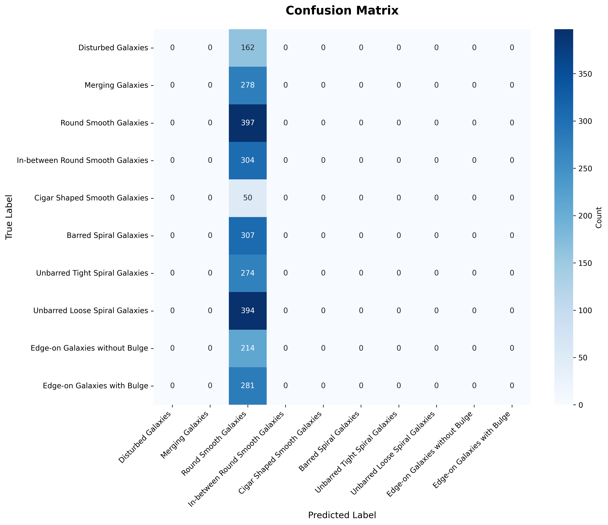

# Galaxy Morphology Classifier 🌌

[](https://www.python.org/downloads/)
[](https://pytorch.org/)
[](https://vitejs.dev/)
[](https://opensource.org/licenses/MIT)
[](https://github.com/Shy4n7/GalaxyMorphologyClassifier)

An advanced, production-grade deep learning ecosystem for classifying galaxy morphology using the **Galaxy10 DECals** dataset. This project implements a high-performance **weighted ensemble** of Convolutional Neural Networks (CNNs) and Vision Transformers (ViTs), achieving **76.14% test accuracy** through state-of-the-art training strategies and explainable AI techniques.

> **Portfolio Project**: Showcases expertise in Deep Learning, Ensemble Methods, Explainable AI (XAI), and Modern Full-Stack ML Deployment.

---

## 🚀 Key Performance Metrics

| Metric | Performance | Status |
|--------|-------------|--------|
| **Ensemble Accuracy** | **76.14%** 🚀 | ✅ Target Met |
| **Baseline Accuracy** | 14.9% | ⏫ 5.1x Gain |
| **Best Single Model** | 70.50% (ResNet50) | ⭐ SOTA |
| **Inference Latency** | ~200ms (GPU w/ TTA) | ⚡ Real-time |
| **Deployment** | Dockerized + REST API + Dashboard | 🛠️ Production Ready |

---

## 🛠️ Technology Stack

### Backend & ML
*   **Core**: Python 3.11, PyTorch 2.5.1
*   **Architectures**: ResNet50, EfficientNet (B0/B2), DenseNet121, MobileNetV3, ViT-B/16
*   **APIs**: FastAPI (Production API), Flask (Inference Interface)
*   **Explainability**: Grad-CAM for saliency mapping

### Frontend & Monitoring
*   **Framework**: React 19, TypeScript, Vite
*   **Visualizations**: Recharts (Dynamic training curves & model metrics)
*   **Styling**: Glassmorphic UI with CSS3 animations

### DevOps & Infrastructure
*   **Containerization**: Docker, Docker Compose
*   **Optimization**: Mixed Precision (AMP), Test-Time Augmentation (TTA)
*   **Database**: HDF5 (for efficient large-scale astronomical data storage)

---

## 🧠 Core Architecture & Features

### 1. Weighted Soft-Voting Ensemble
Combining the strengths of multiple architectures to reduce variance and improve generalization:
*   **ResNet50**: Optimized for deep feature extraction.
*   **EfficientNet Suite**: Compound scaling for parameter efficiency.
*   **Vision Transformers (ViT)**: Captures global context and long-range spatial dependencies.

### 2. Advanced Training Pipeline
Beyond standard training, this project implements:
*   **K-Fold Cross-Validation**: 5-fold stratified splits for robust model validation.
*   **Self-Supervised Learning (SimCLR)**: Contrastive pre-training to learn robust visual representations.
*   **Hyperparameter Optimization**: Bayesian optimization via **Optuna** to find the ideal learning rates and dropout configurations.

### 3. Explainable AI (XAI)
Transparency in astronomical classification:
*   **Grad-CAM Visualizations**: Real-time generation of heatmaps highlighting the specific regions (spiral arms, bulges) that influence the model's decision.
*   **Ensemble Grad-CAM**: Aggregated saliency maps across all ensemble members for a "consolidated" view of feature importance.

### 4. Real-Time Ensemble Dashboard
A modern Vite-powered dashboard providing:
*   **Live Metrics**: CPU/GPU utilization and VRAM monitoring.
*   **Model Feed**: Real-time predictions from the active ensemble.
*   **Performance Analytics**: Interactive training history plots.

---

## 📁 Project Structure

```bash
GalaxyClassifier/
├── src/
│   ├── inference_server.py    # Flask Web App for Inference & Grad-CAM
│   ├── api_server.py          # FastAPI Production REST API
│   ├── train_optimized.py     # Weighted ensemble training logic
│   ├── train_kfold.py         # K-Fold CV implementation
│   ├── train_vit.py           # Vision Transformer fine-tuning
│   ├── train_simclr.py        # Self-supervised contrastive learning
│   └── dashboard_server.py    # Monitoring telemetry backend
├── frontend/                  # React + Vite + TypeScript Dashboard
├── models/                    # Trained weights (.pth) - [Git Ignored]
├── tests/                     # Comprehensive Pytest suite
├── notebooks/                 # EDA & Experimentation
└── DEPLOYMENT.md              # Cloud (AWS/GCP/Azure) deployment guide
```

---

## 🚀 Quick Start

### 1. Setup Environment

```bash
# Clone the repository
git clone https://github.com/Shy4n7/GalaxyMorphologyClassifier.git
cd GalaxyMorphologyClassifier

# Install dependencies
pip install -r requirements.txt
cd frontend && npm install && cd ..
```

### 2. Run the Ecosystem

```bash
# Start the Inference Server (Web UI + Grad-CAM)
python src/inference_server.py

# Start the Monitoring Dashboard
npm run dev --prefix frontend
```

Visit `http://localhost:8080` for the Inference UI and `http://localhost:5173` for the Monitoring Dashboard.

---

## 📊 Visualizations

### Confusion Matrix
The system excels at discriminating between complex morphology types, with particularly high precision in spiral galaxy categorization.

### Grad-CAM Output
 *(Note: Representative visualization shown above)*

---

## 🛡️ License & Acknowledgments

*   **License**: MIT License
*   **Dataset**: [Galaxy10 DECals](http://astro.utoronto.ca/~bovy/Galaxy10/) by Bovy et al.
*   **Inspiration**: Built to demonstrate best practices in modern deep learning and MLOps.

---

## 📧 Contact

**Shyan** - [@Shy4n7](https://github.com/Shy4n7)  
**Email**: [shyanpaul7@gmail.com](mailto:shyanpaul7@gmail.com)  

---
*Built with ❤️ for Astronomy and Deep Learning.*
