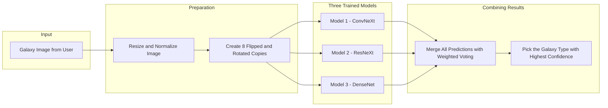

# GalaxyClassifier

Deep learning ensemble for galaxy morphology classification on the Galaxy10 DECaLS dataset.

**87.92% macro-average test accuracy** (TTA) on 10 galaxy morphology classes.

---

## Architecture

3-model weighted soft-voting ensemble trained with PyTorch:

| Model | Params | Test Accuracy (TTA) |
|-------|--------|---------------------|
| ConvNeXt-Tiny | 28M | 87.97% |
| ResNeXt-50 (32x4d) | 23M | 86.40% |
| DenseNet-161 | 27M | 86.28% |

Each model trained independently with:
- 224x224 input, ImageNet pretrained weights
- WeightedRandomSampler for class imbalance
- CosineAnnealingWarmRestarts (T0=20, T_mult=2)
- Progressive stem unfreezing at epoch 20
- Mixed precision (AMP) + gradient accumulation (effective batch 64)
- 8-view Test-Time Augmentation (flips + rotations)

---

## System Architecture


```mermaid
graph LR
    subgraph Input
        A[Galaxy Image from User]
    end

    subgraph Preparation
        B[Resize and Normalize Image]
        C[Create 8 Flipped and Rotated Copies]
    end

    subgraph Three Trained Models
        D[Model 1 - ConvNeXt]
        E[Model 2 - ResNeXt]
        F[Model 3 - DenseNet]
    end

    subgraph Combining Results
        G[Merge All Predictions with Weighted Voting]
        H[Pick the Galaxy Type with Highest Confidence]
    end

    A --> B
    B --> C
    C --> D
    C --> E
    C --> F
    D --> G
    E --> G
    F --> G
    G --> H
```

### How It Works

| Step | What Happens |
|------|--------------|
| 1 | You upload a photo of a galaxy |
| 2 | The image is resized and its colors are adjusted so all three models can read it consistently |
| 3 | Eight slightly different versions of the image are created using flips and rotations, giving each model more angles to consider |
| 4 | All three models independently look at every version of the image and guess what kind of galaxy it is |
| 5 | The three sets of guesses are combined — models that have historically been more accurate get a bigger say in the final decision |
| 6 | The galaxy type with the highest combined confidence score is returned as the final answer |

---

## Dataset

[Galaxy10 DECaLS](https://astronn.readthedocs.io/en/latest/galaxy10.html) — 17,736 images, resized to 224x224, 10 classes:

| Class | Test Acc (TTA) |
|-------|----------------|
| Disturbed Galaxies | 65.4% |
| Merging Galaxies | 93.2% |
| Round Smooth Galaxies | 95.7% |
| In-between Round Smooth Galaxies | 91.8% |
| Cigar Shaped Smooth Galaxies | 94.0% |
| Barred Spiral Galaxies | 84.4% |
| Unbarred Tight Spiral Galaxies | 87.2% |
| Unbarred Loose Spiral Galaxies | 75.4% |
| Edge-on Galaxies without Bulge | 96.7% |
| Edge-on Galaxies with Bulge | 95.4% |

---

## Setup

```bash
pip install -r requirements.txt
```

Download `Galaxy10_DECals.h5` from [AstroNN](https://astronn.readthedocs.io/en/latest/galaxy10.html) and place it in `data/`.

---

## Training

```bash
# Train a model  (convnext | resnext50 | densenet161)
python src/train_optimized_v3.py --model convnext --size 224 --epochs 80

# Resume from checkpoint
python src/train_optimized_v3.py --model convnext --resume models/checkpoint_v3_convnext_*.pth
```

Weights save to `models/best_v3_{model}_{size}_{timestamp}.pth`.

---

## Running

**API server** (port 8080):
```bash
python src/inference_server.py
```

Loads all 3 ensemble models automatically from `models/`.

| Endpoint | Method | Description |
|----------|--------|-------------|
| `/api/predict` | POST | Classify uploaded image (multipart `image`) |
| `/api/gradcam` | POST | Grad-CAM visualization |
| `/api/health` | GET | Model load status |
| `/api/gpu-stats` | GET | GPU memory usage |

**Web UI** (port 3000):
```bash
cd frontend && npm install && npm run dev
```

Open `http://localhost:3000`.

---

## Project Structure

```
src/
  inference_server.py     # Flask inference server (port 8080)
  train_optimized_v3.py   # Training (all 3 models)
  load_data.py            # HDF5 loading, uint8 RAM caching
frontend/
  App.tsx                 # React classifier UI (port 3000)
  components/             # ModelCard, EnsembleFeed
models/
  best_v3_convnext_224_*.pth
  best_v3_resnext50_224_*.pth
  best_v3_densenet161_224_*.pth
tests/
  test_api.py
  test_classifier.py
```

---

## Hardware

Trained on RTX 3050 Laptop GPU (4GB VRAM). Peak VRAM ~1.2GB per model at batch=16.
